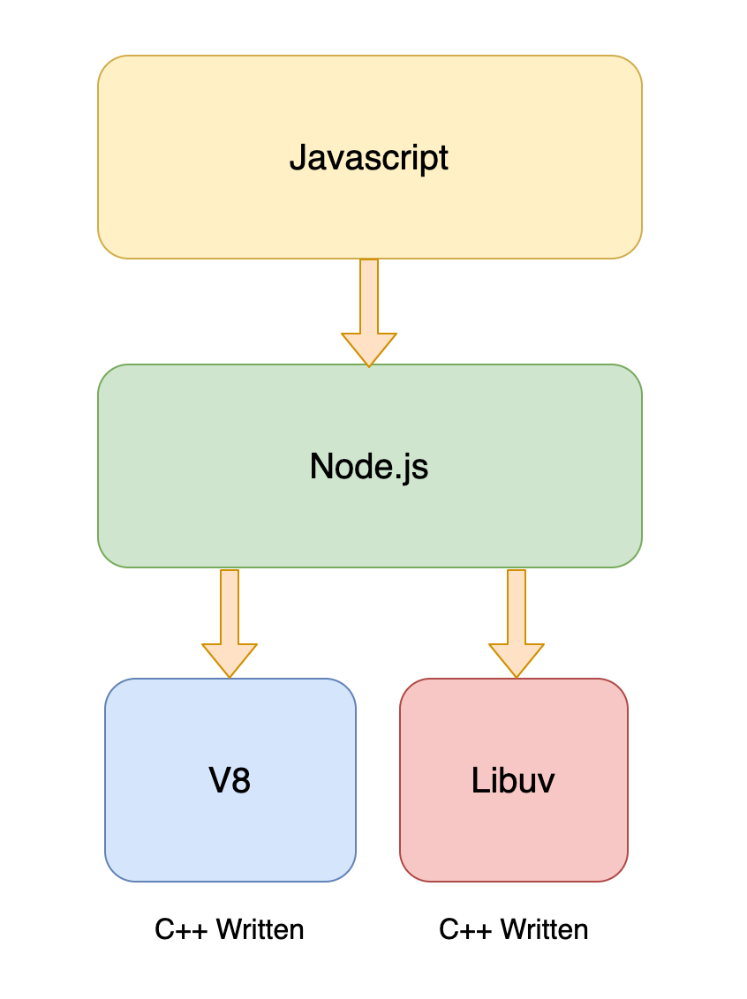

# Introduction to Node.js

Node.js is an open-source and cross-platform JavaScript runtime environment. Node.js runs the V8 JavaScript engine, the core of Google Chrome, outside of the browser. So, we can use javascript as a servers side language.

