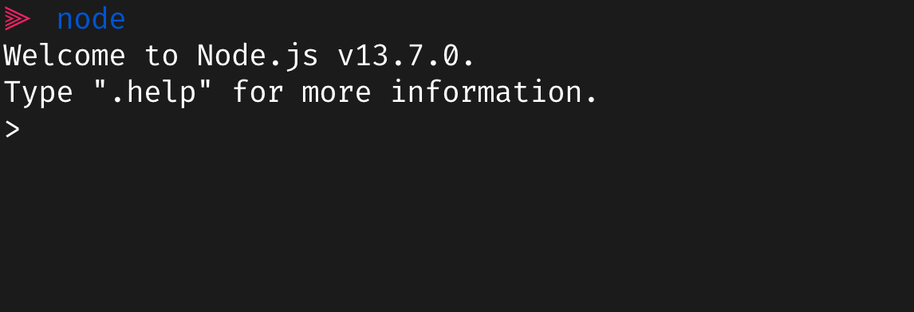
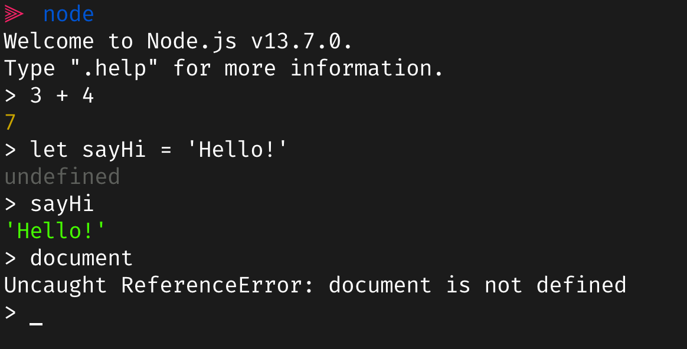
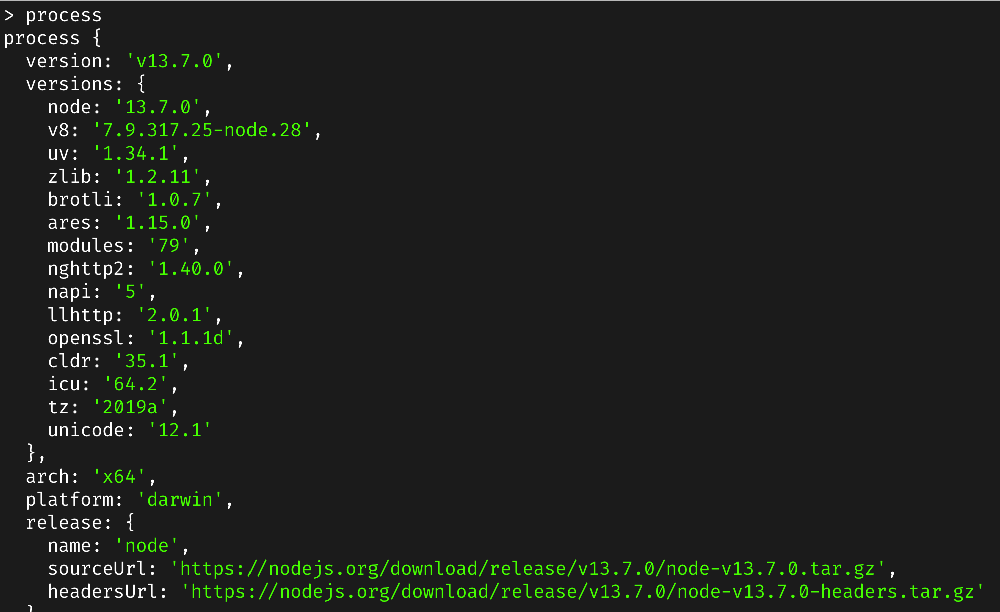

# Introduction to Node.js

Node.js is an open-source and cross-platform JavaScript runtime environment. Node.js runs the V8 JavaScript engine, the core of Google Chrome, outside of the browser. So, we can use javascript as a servers side language.

## Installation

1. Download installation file based on your operating system from [nodejs official website](https://nodejs.org/en/download/)

2. Or install using `homebrew`

```bash
brew install node
```

3. Check if installation is successful

```bash
node -v
v13.7.0
```

## Node REPL

REPL is stand for  
"READ" - Read user input  
"EVALUATE" - Evaluate user input  
"PRINT" - Print output (result)  
"LOOP" - Wait for new input  

You can type `node` in your terminal then you can access to Node REPL



You also can write almost everything about javascript in Node, except some object that not available in Node such `document`. There is no such a `document` APIs in Node because it not a browser.



Node.js have somthing kind of similar to `document` called `process`. `process` gives us various properties and methods for manipulating the node process that's running.



i.e. `process.exit()` is to exit node REPL.
