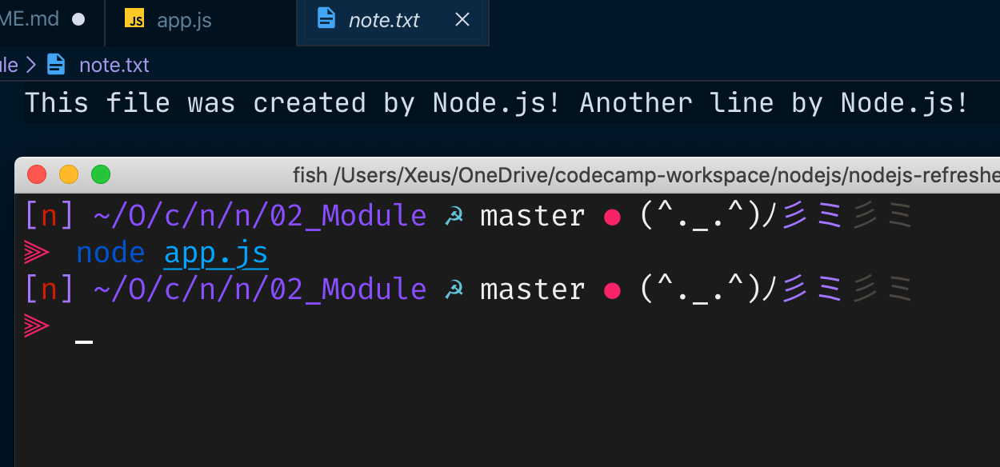

# Node.js Module System

Let's get started with explore node.js module system. The module system lets us load external libraries into our application that we can take advantage of built-in modules or third party npm modules to create web servers, connecting to the database and much more.

## Importing modules

Node.js comes with many built-in modules. These built-in modules, sometimes
referred to as core modules, give you access to tools for working with the file system,
making http requests, creating web servers, and more. Let's see example [file system modules.](https://nodejs.org/dist/latest-v13.x/docs/api/fs.html)

before we use file system modules, we need to load it and define in our script by using `require` syntax

```javascript
const fs = require('fs');
fs.writeFileSync('note.txt', 'This file was created by Node.js!')
```

then run `node app.js` and see what we get.


we get note.txt file with contents that we've written and if we want to append another text to the exiting contents, we have to use another method `appendFileSync`

```javascript
const fs = require('fs');
fs.writeFileSync('note.txt', 'This file was created by Node.js!')
fs.appendFileSync('note.txt', ' Another line by Node.js!');
```



## Importing your own files

