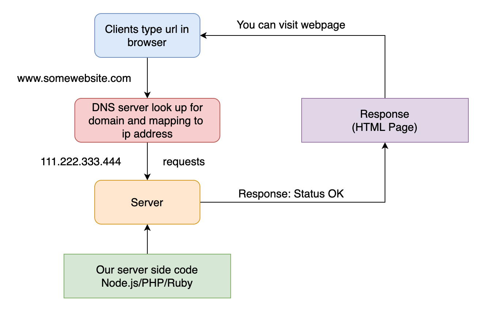

# HTTP Server with Node.js

Before we get started with HTTP server in Node.js, it better to understand concept how the web works. Here is a simple diagram how they interact with each other:


- Clients are typical web user's interact connected devices i.e. PCs, Mobile phone etc. and web browser software like Chrome, Firefox etc.
- Servers are computers that store webpages, websites or applications. When a client devices connected to that webpages, a copy of webpages is downloaded from the server onto the client devices to be display in user's browser.



You can read more about how the web works in more detail at [here](https://developer.mozilla.org/en-US/docs/Learn/Getting_started_with_the_web/How_the_Web_works)

## Create Node.js server

Node.js provide us a very useful `http` module that let us create simple HTTP server. Let's import to our file and create our own server.

```javascript
const http = require('http');

const server = http.createServer((req, res) => {
  console.log(req.url, req.method, req.headers);
  res.setHeader('Content-Type', 'text/html');
  res.write(`
    <h1>Hello, From Node.js server</h1>
    <p>An awesome app will be here</p>
  `);
  res.end();
  // if request comes, please do execute this function
});

server.listen(3000);
```

Let's break down line by line

1. We import `http` module from node core module
2. Create an server with `http.createServer` method
3. This method takes one important argument is requestListener function this function will takes two arguments:
   - request: Incommingmessage
   - response: ServerResponse
4. this function is mean "If request is come, please do execute this function".
5. The reason print `req.url`, `req.method` and `req.headers` is to introduce about some kind of request object. (You don't need to do, but it interesting to know it)
   - request url: `/`
   - request method: `GET`
   - request headers: `object`
6. Send the response back with `setHeader` method which accept arguments `Content-type` that browser understand and accept and value for the header `text/html`
7. Write data to the response with some `html` elements
8. Tell node once we done with creating response by calling `res.end` method.
9. In our `server` object, we can use `listen` method to listen to the incoming request from PORT `3000`

Here is what we get in the browser


