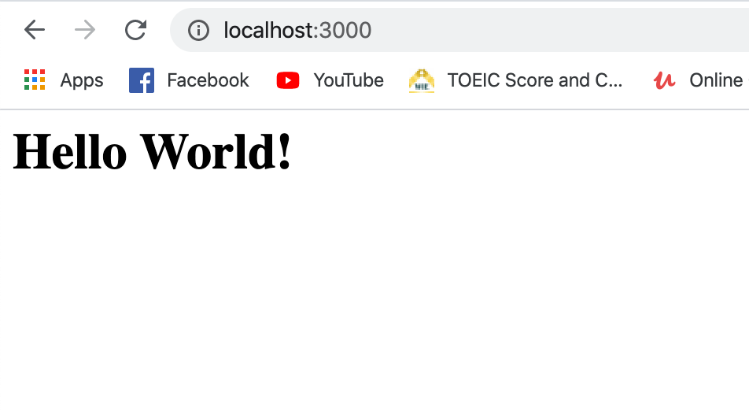

# Express JS

Based on [Expressjs offiecial](https://expressjs.com/) Express is:

> Express is a minimal and flexible Node.js web application framework that provides a robust set of features for web and mobile applications.

Express helps us to easily create web servers whether you want to serve up something like a static website or complex HTTP json based API to server as the backend for mobile or web applications.

## Installation

assume you already have Node.js installed.

1. Create project directory

   `$ mkdir my-express-app`  
   `$ cd my-express-app`

2. Initialize `package.json` with

   `$ npm init`

3. Your entry point will be `index.js`

4. Install `express` via `npm`

   `$ npm install --save express`

5. OK, you are good to go.

## Basic routing

```javascript
const express = require('express');
const app = express();
const port = 3000;

app.get('/', (req, res) => res.send('<h1>Hello World!</h1>'));

app.listen(port, () => console.log(`Example app listening on port ${port}!`));
```

start the server by typing in your terminal

`$ node index.js`

and you should see `Example app listening on port 3000!`

then open the browser and visit the following url `http://localhost:3000/`

and you should see



Compare to last time we've created server with [http](https://github.com/xeusteerapat/nodejs-refresher/tree/master/05_HTTP_Servers#create-nodejs-server) core module of Node.js, it's lots easier. Let's break down the process and learn what is going on behind the scenes.
